# SAP Modernization Lab

## Goal

In this lab, you will learn how ServiceNow Creator Workflows can help you to modernize ERP processes with the tools and functionalities available on the ServiceNow platform.

## Background

A business process refers to a set of activities that have to be performed to complete an end-to-end business scenario. There are multiple business processes in ERPs, the most common ones are listed below:

Name | What is it?
------------ | -------------
Order to Cash | Order to cash (OTC or O2C) is a set of business processes that involve receiving and fulfilling customer requests
Procure to Pay | Procure to pay (PTP or P2P) is the process of requisitioning, purchasing, receiving, paying for, and accounting for goods and services, covering the entire process from point of order right through to payment.
Hire to Retire | Hire to retire (H2R) is a human resources process that includes everything that needs to be done over the course of an employee's career with a company.
Plan to Produce | Plan-to-Produce (Pl2P) encompasses an end-to-end perspective on producing goods. It depicts the shop-floor procedures and focuses on the integration of surrounding aspects into production processes.
Plan to Inventory | Plan to Inventory (P2I) the process of determining the optimal quantity and timing of inventory for the purpose of aligning it with sales and production capacity.
Quote to Cash | Quote-to-cash (QTC) process encompasses many sales, account management, order fulfillment, billing, and accounts receivables functions.
Record to Report | Record to report (R2R) is a finance and accounting management process that involves collecting, processing and presenting accurate financial data.

Often times, there are multiple exceptions outside of an expected business process flow (sometimes refered to as a "Happy Flow") that organizations need to account for - either by customizing the ERP, or relying on manual processes that sit outside of the ERP. 

Then, there is also the issue of data availability. There is a learning curve to navigating ERP systems due to the complexity of the business objects, everyday business users might not have access to the right environment and training to use these ERP systems, and need a friendlier way to interact with the data.

ServiceNow Creator Workflows solves these challenges with it's low code capabilities paired with easy to configure integrations to various ERP systems. We will focus on SAP in this lab.

# Exercise 1: Delegation of Authority

## Introduction

When it comes to automating ERP workflows, nothing is more painful, or more time consuming than the approval cycle. Couple that with a rigid system like SAP, and it becomes difficult to track, let alone automate approvals on everyday transactions like Purchase Orders, Sales Orders, Invoices, etc. A common term for this process is Delegation of Authority (DoA), or Approval Matrix.

Within SAP, [there is such a feature](https://help.sap.com/doc/132b1ea8da1d4281a2da23f3cf506809/2.0.06/en-US/07dc534035524965a902c5bd6ffdbc3a.html), but it is limited in capability and does not scale for exceptional workflows.

## Tales from the field

In one of our customer's internal landscape, they reported having 54 different workflows that covers multiple business objects, and their solution to that was over 12,000 lines of code in a custom .NET application for approvals and authority. Some of these workflows require 7 or more levels of approvals, and any changes to personnel or approval logic requires a major rewrite of the code, which they currently spend over 30 days a year doing. Approvers only have one desktop interface they can use to run these approvals. Obviously not scalable, and a terrible user experience! 

> The sample that we will work with, but it usually gets a lot more complicated than this ☠️

Thankfully, we have the solution for this, so let's start by showing how you can run these approval matrices on top of the Sales Order documents from SAP.

## Let's start

1. Under **All**, search and navigate to **App Engine Studio**

    

1. Click **Create app** on the top right of the screen

    

1. On the Create App page, name the app "Delegation of Authority", and for description, enter "Create an approval matrix for various SAP documents"

    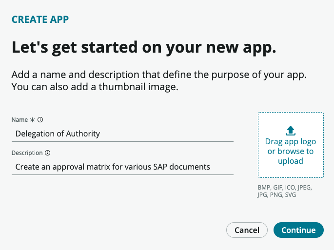

1. Click **Continue**

1. Leave the default roles - *admin* and *user*, and click **Continue**

1. Click **Go to app dashboard**

## Create a Sales Order table

We will now create a table to store Sales Order document data from SAP.

1. Under **Data**, click **Add**

    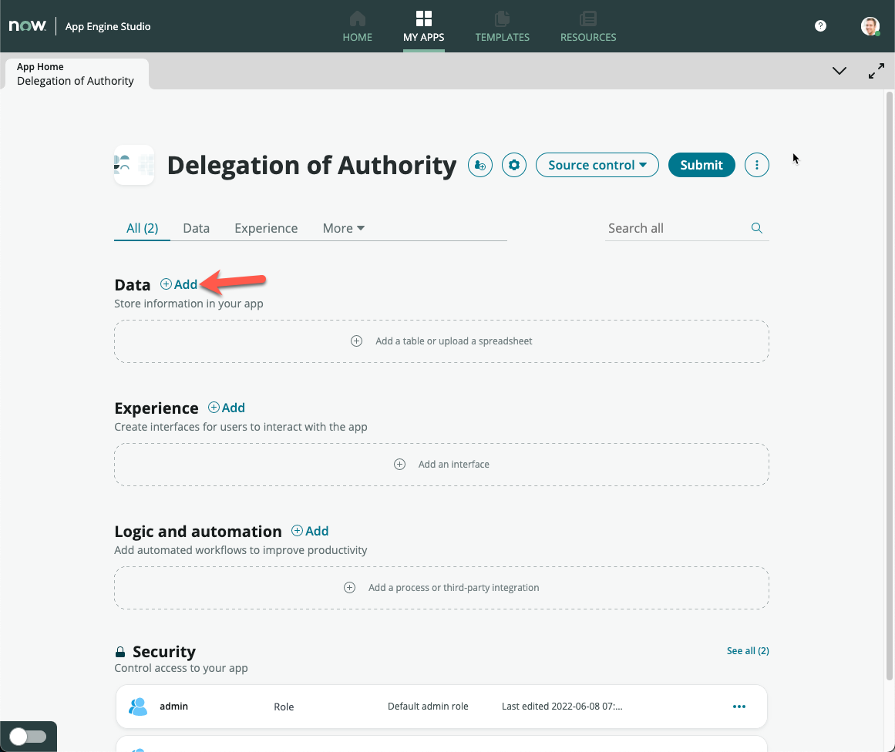

1. Click **Create a table**

1. Click **Get started**

1. On the *Add Data* page, click **Create from scratch**

1. For Table label, enter **SAP Sales Order**. Table name should be auto-populated.

1. Check **Auto number**

1. For Prefix, enter **SAPSO**

    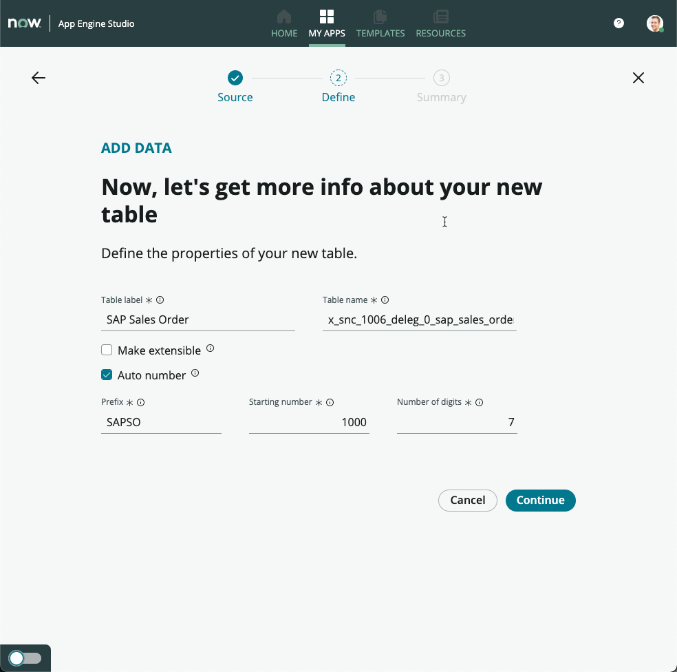

1. Click **Continue**

1. Allow all access for *admin* and *user*, then click **Continue**

    

1. Close the pop-up dialog

1. You should now be on tha *Table Builder* interface. Click **Add new field**, and add the following fields:

    Column label | Type
    -------------- | --------------
    Document number | String
    Document type | String
    Amount | Decimal 
    Sales organization | String 
    Status | Choice (Dropdown with --None--) : New, Approval triggered, Approved, Rejected, Updated SAP

1. Click **Save**, your screen should look like this, then click **Form views**

    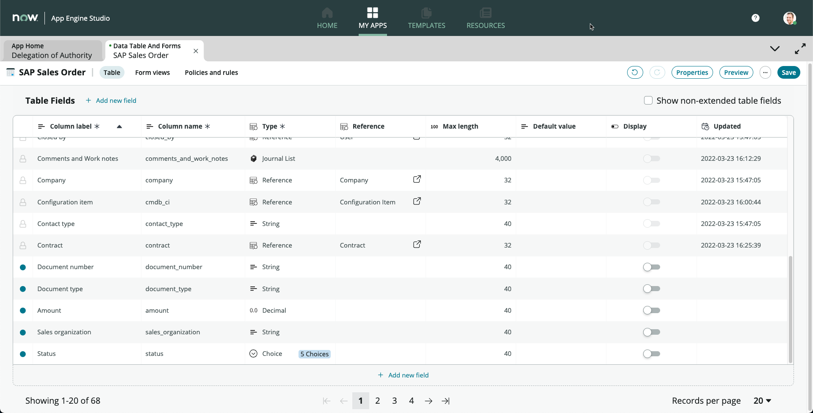

1. Drag the 3 fields you created from the left panel onto the form. Your screen should look like this:

    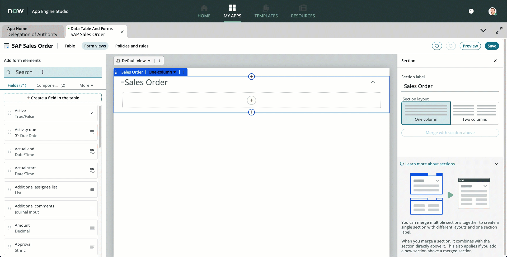

1. Click **Save**

Great, you now have a simple table to store Sales Order data via the SAP integration that we will be configuring next.

## Get Sales Order data via the SAP ERP Spoke

1. Go back to the app home page 

1. Under *Logic and Automation*, click **Add**

1. In the *What do you want to add* screen, click **Flow**

    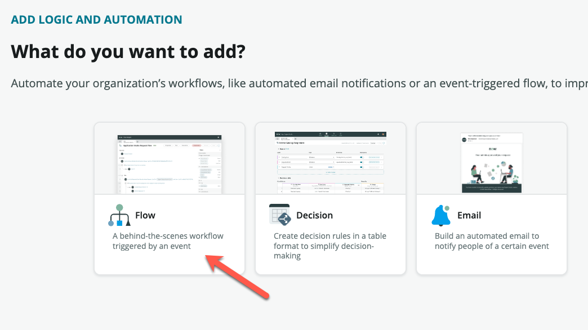

1. Click **Build from scratch**

1. Under **Name**, enter "Get Sales Orders from SAP every hour"

1. Click **Continue**

1. Click **Edit this flow** once you see the *Success! Your flow is ready.* screen

1. Close the pop-up box

1. Click **Add trigger**

1. Under the *Date* section, click **Repeat**

1. Change the repeat duration to 2 hours

    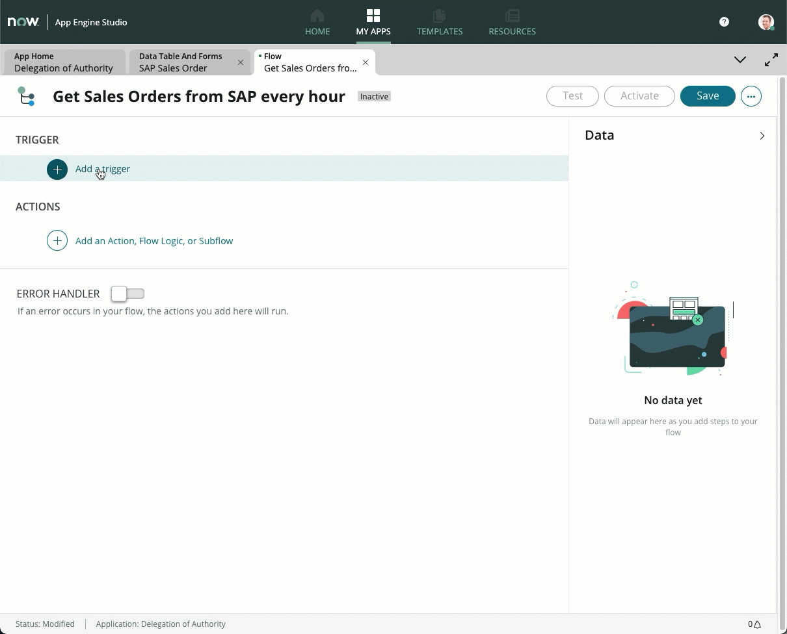

1. Click **Add an Action, Flow Logic, or Subflow**

1. Click **Action**, and you should see a dropdown appear

1. In the *Search* bar, enter **SAP**

    

> You should be able to see a few different SAP spokes show up. There are 2 different integration methods to both SAP ECC (Older version) and SAP S/4 HANA available in ServiceNow's out of the box integrations available in the Enterprise package of Automation Engine. 
   
Let's break down what these mean: 
  
**SAP ECC**: Most of the companies running on SAP are running on SAP ECC. It is the offering for a large enterprise. Companies with large volume, complex business processes and operating in multiple geographies go for SAP ECC. It is built on ABAP stack. 
  
**SAP S/4 HANA**: This is the latest release of SAP ERP and it can run only on HANA database. With this release, SAP has simplified their core database architecture. This together with in-memory processing enables business to do complex business computation within minutes.
  
**Integration via IDoc**: IDOCs or intermediary documents are another way to exchange information to and from SAP. If you are more aware of web technologies, consider IDOCs as XML. It consists of neatly defined data segments with parent and child nodes. There are specific steps to configure inbound and outbound IDOCs.
  
**Integration via RFC**: If you are looking at a real time SAP system integration scenario, RFC is probably the best way to go. In this case, certain functions are enabled for remote call. One such function could be for example sales order creation. Third party applications can integrate with SAP using these RFCs for a real time communication and business process validation (example price computation, minimum order check etc.).

15. Click **SAP ERP**, this is a simulation of the actions available in the other prebuilt spokes.

1. Click **Look up Sales Orders**

    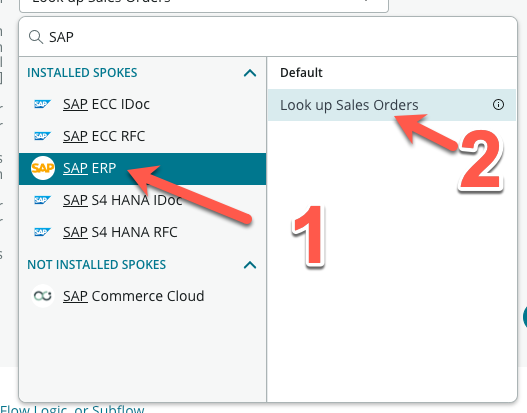

1. In the action that shows on the screen, have a quick look at what shows up. These are a subset of the filter options available in the OOTB spokes to retrieve a list of Sales Orders. In this exercise, we will only return one Sales Order record for easier accesibility.

    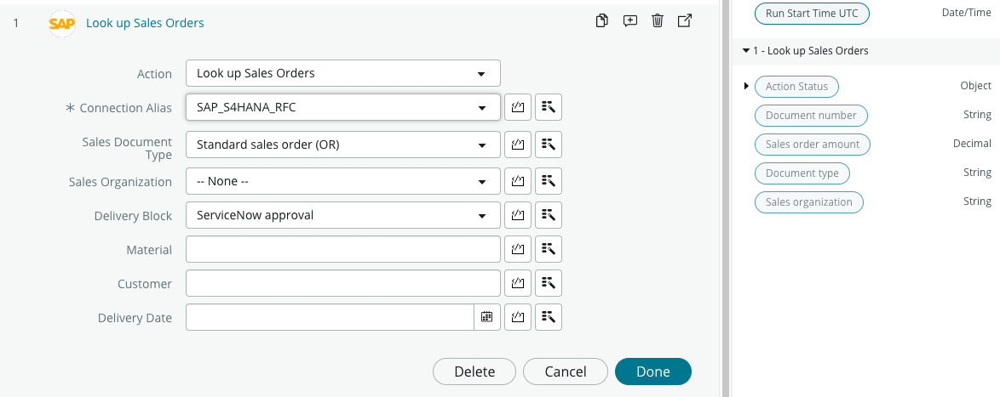

1. Notice how the **Delivery Block** field is populated with **ServiceNow approval**. Delivery block when applied, blocks the sales order for delivery i.e., delivery cannot be created until the delivery block is removed by the authorized person. This list can be customised in SAP, and the logic would be that as Sales Orders are created in SAP, this Delivery Block status is automatically applied until the approval is completed in ServiceNow.

1. Leave everything as it is, and click **Done**

1. Click **Add an Action, Flow Logic, or Subflow**

1. Under **ServiceNow Core**, click **Create Record**

    

1. On the table field, search and select **SAP Sales Order** (the custom table you created)

1. Click **Add field value**, select **Document number**

1. Drag the **Document number** data pill into the input field

1. Repeat the above 2 steps for **Amount, Document type** and **Sales organization**

    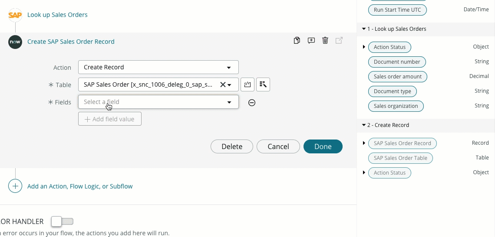

1. Click **Save** on the top right of the screen.

1. Click **Test**

1. Click **Run Test**

1. Click **Your test has finished running. View the flow execution details.**

    

1. In the new tab that opens, click the **Create Record** action

1. Click the Record, if you followed the guide so far, the record should be **SAPSO0001001**

    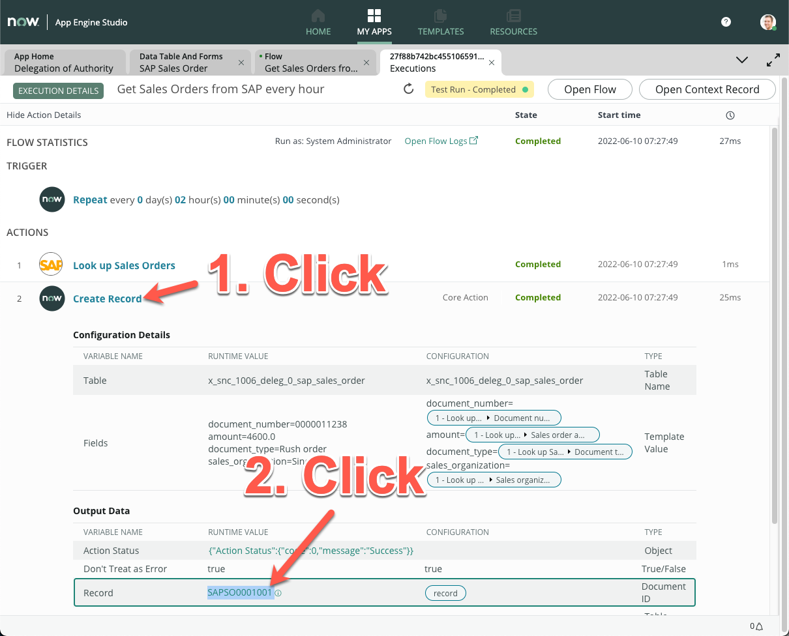

1. In the pop-up box, click **Open Record**, it should open in a new browser tab, ensure that all the fields are populated. (Your output will be different)

    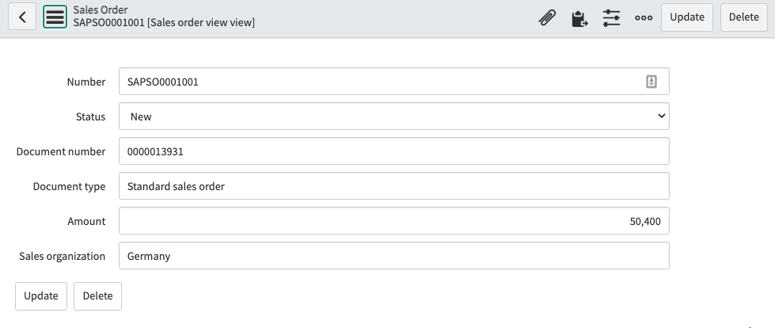

Congrats! You have built the integration to get Sales Order data from SAP. Go back to the previous browser tab, but don't close anything yet.

## Building the approval matrix using decision builder

For this part of the exercise, we will rebuild this following approval matrix

1. Go back to the **App Home** tab

1. Under *Logic and automation*, click **Add**

1. Click **Decision**

    

1. Click **Get started**

1. Under Name, enter **Sales Order Approval Matrix**

    
> If you face an issue with the Continue button, you might have to close this screen and click Decision again

6. Click **Continue**

1. Click **Edit decision table**

1. Click **Add an input**

1. Under label, enter **Sales order record**

1. Under type, select **Reference**, and under Table, search and select **SAP Sales Order**

    

1. Click **Save** on the top right

1. Click **Add result column**

    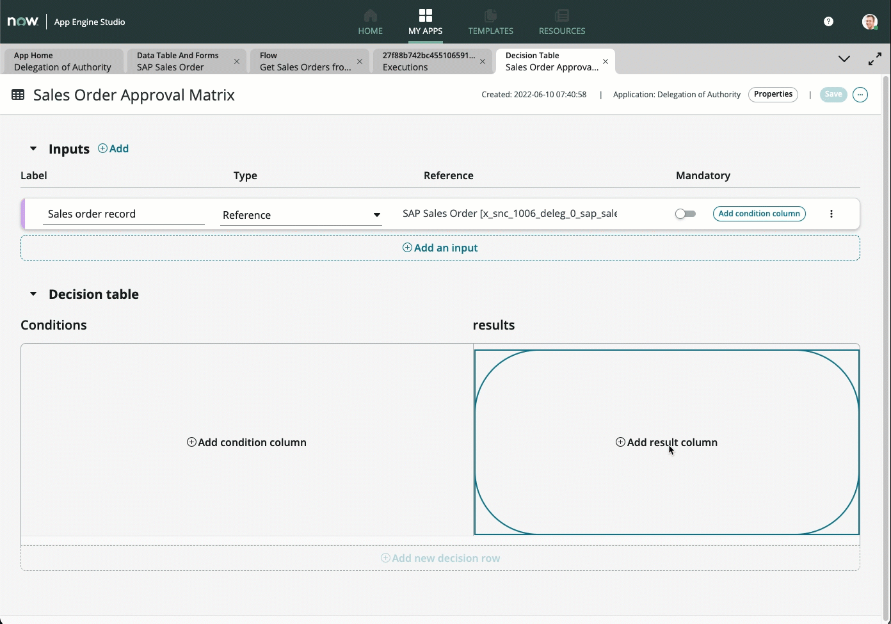

1. Under Result column label, enter **Approval group**

1. Click **Result type**, then select **Reference**

1. Under **Result table**, search **Group** and select **sys_user_group**

1. Click **Done**

1. Under the **Approval group** column, add these selections as per our matrix at the start of this section: Finance managers, Finance controllers, CFO, CFO

    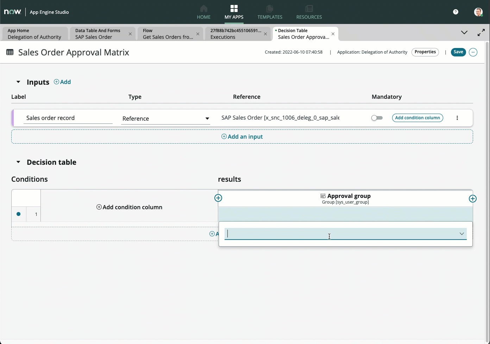
    
1. Now we have the results, we need to add the conditions.

1. Click **Add condition column**

1. In the pop-up, select the fields as per the image below

    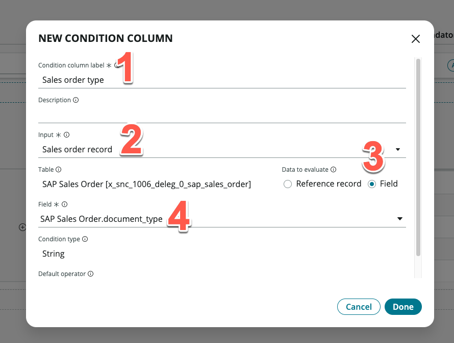

1. Click **Done**

1. Click on the **Plus sign** in between the 2 columns

    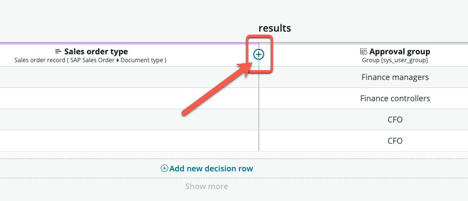

1. Click **Add condition column**

1. Fill in the pop-up modal as per the image below

    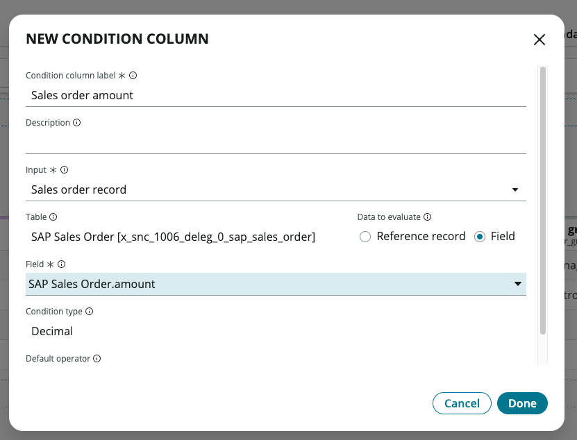

1. Click **Done**

1. Click on the top left selection box, select **less than**, and Value **5000**

    

1. On the box to the right, select **is**, and Value **Standard sales order**

    

1. See if you can fill in the rest according to the matrix below (You have just completed the first row)

29. Your screen should look like the following once complete

30. Click **Save** on the top right

# Exercise 2: Streamlining the Goods Receipt Process

## Goal

In this exercise, you will use the NLU Workbench to create, train and test a *NLU model* to be used in the topic created in the previous exercise. The NLU model is built to help the system understand human-expressed intent regarding user requests for access to systems, data, roles, equipment, and other entities. You will use this model to help the system understand the same use case as before (a parent requesting a student withdrawal from an activity).

1. Navigate to **All > NLU Workbench > Models**.

    

1. The system displays the *NLU Workbench* page.

1. Close any pop-ups that appear on the screen.

1. Click **Start from blank** on the top right on the screen to create a new model.

    

1. In the next screen, define the fields as follows:

    Field | Value
    -------------- | --------------
    Name | Student activities
    Short description | Manage different aspects of student activities
    What is the primary language? (autofilled) | English -en 
    What are you creating this for? (autofilled) | Virtual Agent
    What business area is this for? (optional) | *--Not specified--*

    

1. Click **Next**.

1. Click **View Model**.

1. In the pop-up window, Click **Add content**.

    

1. Click **New intent**.

    

1. Define the intent properties as following:

    Field | Value
    -------------- | --------------
    Intent Name | Withdraw from activity
    Description| Withdraw a student from approved activity

    

1. Click **Add intent**.

1. Provide some *utterance examples*.

    * withdraw from activity

    * cancel student permission

    * deregister student from event

    * student unable to attend activity

    * remove after school program

    For the purpose of this exercise, we are only going to have 5 utterances, but you can always add more to improve accuracy.

    

    Next, we'll create another intent for this model.

1. Click **Manage your model content** on the top *breadcrumb navigator*.

    

1. Confirm that **#Withdraw from activity** shows up in the list, then click **New Intent**.

    

1. Define the intent properties as follows:

    Field | Value
    -------------- | --------------
    Intent Name | Approve permission task
    Description| Approve an assigned permission task

    

1. Click **Add intent**.

1. Provide 5 utterances:

    * approve permission task

    * grant activity permission

    * view open activities to approve

    * allow student to attend activity

    * give permission for activity

     > A second intent is required as part of a NLU model. However, we will not be using this second intent in our topic for this session.

1. Click **Train model**. (1)

1. In the side bar that appears on the right, click **Train**. (2)

    

1. If all above steps are configured correctly, the system displays a message: *The model has been successfully trained*.

    

    We can now run a quick test of the model.

1. Click **Try Model**.

1. Enter any phrase related to withdrawing a student from an activity. For example:

         I want to remove student from an activity.

1. Locate **Top Prediction(s)** under the phrase.

1. Verify the *Withdraw from activity* intent is identified with a percentage of confidence.

    

1. (Optional) Try another phrase with the intent of approving a permission task. For example:

        Grant student permission to attend an activity

    The **Top Prediction(s)** should identify as *Approve permission task*.

    

Congratulations! You've created a NLU model. We will now use this in the *Withdraw from activity* topic we created in Exercise 1.

# Exercise 3: Automating Financial Close

## Goals

The financial close is a critical process that happens regularly (Monthly, Quarterly, Yearly) in a business with the general goal of producing financial reports representative of the company's true financial position. This is a stressful exercise and there is typically a checklist of activities that the finance team has to undertake, for example: Perform inventory count, reoncile account and post Journal Entries, update cash flow statements, balance petty cash funds, any many more.

Many of these activities also tie back to SAP as the system of record, but this is essentially is a workflow activity, not a record one! Navigating across SAP, updating, checking then reporting then becomes a huge headache. So can we make this better? Obviously!

In this exercise, let's focus on one of the key activites, which is Journal Entry posting from ServiceNow to SAP.

> A journal entry is used to record a business transaction in the accounting records of a business. A journal entry is usually recorded in the general ledger; which is then used to create financial statements for the business.The logic behind a journal entry is to record every business transaction in at least two places (known as double entry accounting).

1. On the top navigation bar, click the **Globe** icon towards the right.

1. Click **Application scope: Student Permission** under the drop down.

1. In the list that appears, select **Employee Center Core**.

    

    The system automatically refreshes the screen.

## Applying Virtual Agent brand elements

1. Navigate to **All > Conversational Interfaces > Home**.

    

    The system opens a new browser tab for the *Conversational Interfaces Home*. All the settings and configurations you need to set up and launch your interfaces, such as *Virtual Agent* and *Agent Chat*, are found here.

1. Spend a few moments to get acquainted with the page, then click the **Chat Settings** tab on the top of the page.

    

1. On the *Branding* block, Click **View all**.

    

1. In the *Branding* list, click **EC Branding**.

1. Change **Chat Header** to **Parent Support**.

1. Save the following image to your local drive. (Right-click -> Save Image As...)

    

1. Under *Chat Header Logo*, Click the **Trash Bin icon**, and in the **Delete image** pop-up, select **Delete**.

    

1. Click **Attach image**, then upload the file you just downloaded.

1. Click **Save** on the top right, and your screen should look like the following. If it does not, refresh the browser window.

    

## Turning on NLU

1. On the left navigation bar, select **Virtual Agent**. The screen should now display **Virtual Agent Settings**. (1)

    Notice how under the *Natural Language Understanding (NLU)* block, **Status** is set to **Off**.

1. Click **View settings**. (2)

    

1. Under the *NLU Service Provider* dropdown, select **ServiceNow NLU**. (1)

1. Leave the two options below **off**.

1. Toggle the **Activate** switch on the top right of the screen. (2)

    Your screen should now look like the following:

    

1. Click **Save**. (3)

## Applying NLU on Withdraw from activity topic

1. Navigate back to the main *ServiceNow UI* browser tab.

1. Using the same method as before, change the application scope back to **Student Permission**.

    

1. Navigate to **All > Conversational Interfaces > Virtual Agent > Designer**.

    

1. Scroll down and click the **Withdraw from activity** topic card.

    

1. Click **Properties** on the top left.

    

1. In the section *Set up Natural Language Understanding (NLU)*, set the following in the respective order:

    Field | Value
    -------------- | --------------
    NLU Model |   Student activities (English)
    Associated Intent | Withdraw from activity

    

    > The NLU model will now be used for topic discovery/identification in place of the keywords that you entered before.

1. Click **Save**.

1. Click **Test**.

    The system displays a checkbox that allows you to *Include topic discovery*.

1. Enter a statement in the chat of your choice with the objective of withdrawing from an activity. For example:

        I would like to withdraw my child from an activity.

    

1. Verify that the test phrase has been analyzed and the *Intent* has been invoked.

1. You can continue testing more phrases by clicking the **refresh icon** on the top bar.

    

1. Close the pop-up window.

    Now that we have verified that the NLU Model works, the next step is to publish it along with the topic.

1. Click the **NLU Intent tab**. (1)

1. Click **Publish Model**. (2)

1. On the right sidebar that now appears, Click **Publish**. (3)

1. In the pop-up, Click **Publish**. (4)

1. Click **Publish** on the top right.

    

1. Confirm that the topic is **Active**.

     

Congratulations! Your topic is now Active and ready to be used in Virtual Agent conversations.

# Exercise 4: Testing the topic in Employee Center

## Goal

In this final exercise, we will test our published Virtual Agent topic in *Employee Center*, and will also review the design changes we made to the Virtual Agent.

The first step is to *impersonate* a Parent.

1. Click the **Profile avatar** on the top right of the screen.

1. Select **Impersonate user** under the list of options.

1. In the pop-up, search for user **Fred Luddy**.

    

1. Navigate to **All > Self Service > Employee Center**.

    The system opens *Employee Center* in a new browser window.

    

1. Click the **Chat bubble** at the bottom right of the screen to open Virtual Agent.

    

1. Confirm the visual changes that you made are reflected in the conversation window.

    

1. Type in a request related to withdrawing a student from an activity. For example:

         I want to withdraw student from an activity

1. Choose any of the activities to withdraw from, and complete the rest of the conversation.

    

1. Trigger the topic one final time by clicking on **Click here to start a new conversation**.

1. Ensure that the activity you just withdrew from does not show up on the list any longer.

    > You should only have one Activity Permission Task left to choose from. The message shown would be as follows:

    

Congratulations you have completed the entire lab!

# Bonus Exercise: Enhance NLU accuracy by adding vocabulary

## Goal

Increase the accuracy of the NLU model that we built by using vocabulary to provide synonyms to the keywords in our topic.

1. Click the **Profile avatar** on the top right of the screen.

1. Click **End impersonation**

    

1. Navigate to **All > NLU Workbench > Models**.

    

1. Open your *Student activities* model by clicking **English** next to **Student activities**.

    

1. On the *Student activities* model page, click the **Vocabulary** box title to be brough to the *Vocabulary* screen.

    

1. Click **Add synonym**.

    

1. In the **Add Synonym** pop up box, fill in the details as follows:

    Field | Value
    -------------- | --------------
    Type |   Regular
    Vocabulary | Student
    Synonym |  (press *enter* after each synonym to add) *child, ward, pupil, son, daughter, kid*

    Once completed, it should look like this:

    

1. Click **Save**.

    Let's add another synonym for *activity*.

1. Click **Add synonym**.

1. In the **Add Synonym** pop up box, fill in the details as follows:

    Field | Value
    -------------- | --------------
    Type |   Regular
    Vocabulary | Activity
    Synonym |  (press *enter* after each synonym to add) *course, afterschool, program, extra-curricular, event, field trip, visit*

    Once completed, it should look like this:

    

1. Click **Save**.

    Before re-training the model, let's first test an utterance to see the current intent prediction percentage.

1. Click **Try model** on the top right, and in the search field, enter the phrase:

        Withdraw my daughter from upcoming field trip

1. Click **Go**.

    

    > This utternace is predicting the topic correctly, but only at a 68% confidence level.

1. Take note of the percentage value for the intent.

1. Click **Train model**.

    

1. Click **Train**.

    Once training has been complete, you should see a success message:

    

    Repeat the previous steps.

1. Click **Try model** on the top right, and in the search field, enter the phrase:

        Withdraw my daughter from upcoming field trip

1. Click **Go**.

1. Take note of the prediction percentage now, it should be higher than your first try.

    

    > The confidence level is now 77% versus 68% before.

Well done! We have now made the Virtual Agent more accurate in topic identification, giving users and even better experience in getting their requests and queries resolved. Feel free to add even more synonyms to improve accuracy of your NLU model, or try out other phrases.
